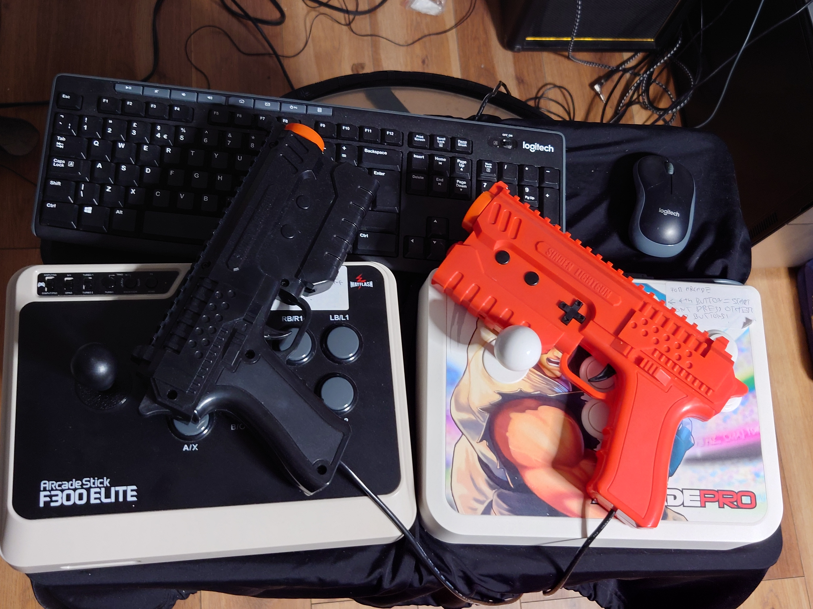



### My Main Work/Media/Gaming PC 'studio.local'

- Ryzen 7 9800X 3D CPU
- GIGABYTE B850 AORUS ELITE WIFI7 Motherboard with 2.5Gbits/sec internet and on-board Wifi7
- Be quiet! Straight Power 12 1000W power supply, ATX 3.0, 80 PLUS Platinum
- Cooler Master MasterAir MA824 Stealth CPU Air Cooler
- Samsung 990 PRO NVMe M.2 SSD, 4 TB, PCIe 4.0, 7,450 MB/s read, 6,900 MB/s write, Internal SSD
- Fractal Design North XL Charcoal Black Mesh
- G.Skill Trident Z5 Neo EXPO RGB 64GB (2x32GB) DDR5 PC5-48000C30 6000MHz
- ASUS GeForce RTX 4070 12G DUAL EVO OC Gaming Graphics Card - 2550MHz Boost Clock, GDDR6X, PCIe Gen 4, DLSS 3, HDMI 2.1a, 3 x DisplayPort 1.4a (Supports 4K & 8K HDR) * 12th Gen i7 CPU
- 1x 1TB SSD that I use as a system drive for legacy reasons
- 10Gb/sec fibre optic network card

#### Keyboard and Mouse

- Topre Realforce TKL UK model
- 8BitDo Retro 18 Mechanical Numpad, Supports Calculator Mode, Bluetooth/2.4G/Wired Numpad for Windows and Android - C64 Edition
- LOFREE TOUCH PBT Wireless Mouse with USB receiver, Bluetooth, Wired Connection, Rechargeable, 4000 DPI with OLED Screen Compatible with glass surface for Mac Windows PC Notebook/Block Retro White Gray

#### Monitor and Other accessories

- ASUS ROG Swift OLED PG32UCDM 4K gaming monitor ― 32-inch 4K QD-OLED panel, 240Hz, 0.03ms (GTG), G-SYNC compatible, custom heatsink, graphene film, uniform brightness, 99% DCI-P3, True 10-bit, 90 W Type-C
- LG Ultragear Gaming Monitor 24GS65F, 24 Inch, 1080p, 180Hz, 1ms, IPS Display, HDR 10, NVIDIA G-Sync Compatible & AMD FreeSync, used in portrait mode usually
- 2x Genelec 8020 DPM speakers
- Logi USB headset with noise cancelling microphone
- Logitech Key light for web cam calls
- Elegato Facecam
- R0de Procaster mic with boom, roll cage and muffler
- ClonerAlliance Flint 4KP Plus video capture card with USB-c 3.0L
- Presonus 1824c Studio Sound Interface
- Phillips Hue Entertainment centre with 2 light sources and Hue Sync

#### Ergonomic Equipment

- Flexispot E7Pro Motorised Standing Desk
- Flexispot BS14 ergonomic chair with headrest
- Flexispot standing desk mat
- Wooden rocker balance board
- 360 style balance board
- Fenge Dual Monitor Stand
- FIFINE Microphone Arm Stand, Boom Arm Stand with Desk Mount Clamp
- BenQ ScreenBar Halo 2 LED Monitor Light Bar
- Maksone Under Desk Treadmill

### My TVs

#### My CRT

- Sony Trinitron KV-14LT1U 14" RGB Retro Gaming CRT TV
- External speakers with separate bass, treble and mid
- [RetroGamingCables.co.uk](https://www.retrogamingcables.co.uk/) SCART switcher and SCART cables.

#### My Light GUN / SCART LCD TV

- Sony KDL-40R453C 40-inch Sony Bravia Full HD 1080p LED TV with SCART

#### Living Room TV Setup

We have a separate minimal setup in our living room which my wife uses heavily. It is minimal because she doesn't like overcomplicated tech stuff :) It consists of:

- Sony BRAVIA 2023 Edition, KD-43X75WL, 43 Inch, LED, Smart TV, 4K HDR, Google TV
- Logitech 5.1 Z906 Surround Sound System

Because it has Google TV, we can use the Plex app to wirelessly stream 4K videos from my Plex server, and it handles 4K HDR videos well.

#### Light guns and Pedals

- Sinden PC light gun with recoil (Black)
- Sinden PC light gun without recoil (Red)
- 2x iKKEGOL USB Metal Foot Pedal (for duck and cover mechanics with light gun games)



### My Gaming Laptop 'legion.local'

- Lenovo Legion 5-15IAH 2022
- i7 12th Gen
- 64GB DDR5 RAM
- 2x 2TB NVME M.2 4th Gen SSDs
- Nvidia Laptop 3070TI
- Cooling Gaming Laptop Pad

### Gaming PC Software

- Launchbox - this brings all my third party launchers together and collates metadata, preview videos and reviews for games I own.
- RetroArch & various open source emulators - these plug into Launchbox and let me play many different console games on my PC.
- Hue Sync - this allows me to sync my Hue entertainment area lights with the colours on the screen, while playing games.
- NexusMods and Vortex app - I have a lifetime membership of NexusMods, and this allows me to download, install and configure hundreds of mods for many games such as Cyberpunk 2077 and Skyrim, at high speeds.
- Razer Synapse - These allow me to create custom control profiles for the Razer hardware for some of the games I frequently play.
- Action! - Gameplay Recording and Streaming (on Steam) - for recording PC gaming
- PCMark 10 - for benchmarking hardware upgrades



### My PC Gaming Controllers

#### Non-Official Joypads and Official Joypads available for PC use and multi-console use

These all work with the gaming PC and laptop and connect via USB:

- XBox Elite V2 White Controller
- Buffalo SNES USB Gamepad
- XBox Duke Controller with USB adaptor
- 1x PS1 Controller with USB adaptor
- 2x PS2 Controller with USB adaptor
- 1x PS3 Controller with USB cable
- 2x PS4 Controller with USB cable
- XBox One Official 'Cyberpunk 2077' Controller - collectors item, although I did complete Cyberpunk 2077 on PC with it!
- 2x SNK Neo Geo Mini Controller with USB adaptor - these are extremely well-built controllers!
- 2x 8BitDo SN30 SNES-style 2.4ghz wireless controllers
- 2x 8BitDo N30 Neo Geo-style 2.4ghz wireless controllers
- 2x 8BitDo M30 Megadrive-style 2.4ghz wireless controllers
- 2x Retro Fighter Tribute64 2.4ghz wireless controllers for the Nintendo 64. They have an inbuilt rumble pack.
- 2x 8BitDo Pro 2 Bluetooth controllers for the Playstation 2 and other platforms, with 2x 8BitDo PS/PS2 adaptors.
- HORI Pacman style Switch Joycon replacement controller.
- 1x Retro-Bit Origin8 2.4 GHz Wireless Controller For Nintendo Switch & NES
- Razer Tarturus Chroma Pro Gaming Keypad

#### VR Hardware

- Meta Quest 2 VR headset + 2x controllers

#### Steering Wheel and Pedals

- HORI Racing Wheel Overdrive for XBox One and PC (with pedals)

#### Retro Digital Joysticks

- Monster Joysticks 9-Pin Amiga Joystick to USB Adapter V2
- Zip Stick Original Amiga Joystick with Amiga port
- Speedlink SL-650212-BKRD Competition PRO Joystick - USB Anniversary Edition
- 'The Scorpion' Retro gaming joystick with Amiga port
- Quickshot 1987 C64/BBC joystick with DIN plug



#### HOTAS

I have two Flight Sticks and a throttle. The dual Flight Stick setup is useful for Mechwarrior style games, although I usually use the Flight Stick + Throttle for most games. They are installed on quick-release Hikig desk mounts so they can be easily setup and removed when not in use, to save space.

- 2x Thrustmaster T16000M Flight Stick
- Thrustmaster TWCS Throttle
- 3x Hikig HOTAS Mount



##### Arcade Sticks

- 2x Mayflash Arcade Stick F300 Elites with Sanwa buttons and stick using 8-way restrictor plates
- Datel Arcade Pro Joystick using 4-way restrictor plate

##### Retro Games Consoles

I have a [Kaico Edition OSSC Open Source Scan Converter 1.6](https://kaicolabs.com/product/kaico-edition-open-source-scan-converter-ossc/), which upscales all my retro consoles to HDMI. I use cables from [https://retrogamingcables.co.uk/](https://retrogamingcables.co.uk/) with the OSSC, which are highly recommended as they make so much difference in terms of audio and video noise. The right cable can also unlock better sound and graphics quality when combined with the OSSC than was ever available before.

I also have a [Marsellie MClassic](https://marseilleinc.com/products/buy-mclassic) HDMI to HDMI hardware-based AI image improver and upscaler which I use for the output of the OSSC.

Currently these are the consoles I have hooked up. They are all 'PAL' unless otherwise specified:

- **Super Nintendo** with 2x official controllers and NTSC and J-NTSC cartridge converter and Super Everdrive X5 with ALL ever released SNES games on a MicroSD card.
- **Sega Megadrive II (region unlocked)** with 2x official 3 button controllers, 2x official 6 button controllers and Master System cartridge converter, and an Mega Everdrive x5 cart with ALL released Megadrive/Genesis games available.
- **Fat Sony PS2** with 2x official PS2 controllers, and 1 x official PS1 controller, and 2x Guitar Hero PS2 Controllers. I also have a 6TB drive in it with ALL released PS2 NTSC and PAL English games available.
- **Nintendo 64 PAL modded edition for RGB** with 2x official N64 controller, Kaico PAL N64 -> HDMI converter (audio output via HDMI), expansion pak and memory pak, and 64 Everdrive cart with ALL released N64 games accessible on a MicroSD card.
- **Sony PS3** with 1x official PS3 controller
- **Sony PS4** with 2x official PS4 controllers
- **Nintendo Gamecube** with 2x official Gamecube controllers
- **XBox 360** with 2x official wired 360 controllers and 360 Kinect
- **Sega Dreamcast** with 3x official DC controllers, 2x VMUs and 1x third-party memory pack
- **Sony PSP2000** (TV out)
- **Nintendo Wii (Gamecube compatible version)** with 2x Wiimote Motion controller and official balance board
- **Nintendo Wii U** with CFW Aroma installed and 1x Wii U Gamepad and 1x Wii U Pro Controller
- **Nintendo Switch Unpatched V1** with CFW installed, 2x Joycons, Dock and 2x Switch Pro Controllers
- **Microsoft XBox Original** with 2x Duke controllers
- **SNK Neo Geo International Mini** with 2x official controllers, and mini HDMI to HDMI cable for monitor output (audio output via HDMI)
- **Nintendo NES Mini** with 2x controllers and extension leads
- **SNES Mini** with 1x controller
- **Sony Playstation Mini** with 2x official controllers
- **Evercade VS-R Console** with 2x official controllers
- **SNK Neo Geo CD** console with SD card loader and all available games accessible, with 2x 8BitDo SNK Neo Geo Wireless controllers + adaptors and 2x usb to controller arcade stick adaptors to allow most fight stick/arcade sticks and most PS3/PS4 controllers to be used
- **PC Engine Duo** console with everdrive and all available games accessible, with 1x offical PC Engine pad, and a 2x Wireless adaptor that can be used with most bluetooth controllers, including >1 player games,
- **PC Engine TurboGraphix Mini** console with 2x 8BitDo PC Engine mini pads
- **Evercade Alpha Street Fighter 2 Edition**



##### Portable Retro Games Consoles

- **Sony PS Vita OLED 1st Gen** with cracked firmware and a 64GB memory card, allowing it to play any game from the store via Nopaystation.
- **Sony PSP** which I have cracked, and put a 64GB memory card in it. It has a complete set of SNES and Genesis games, as well as several PS One games which the PSP can emulate. I love playing the game 'Wip3out' on it.
- **Nintendo DSi XL** with DSPico and a complete set of all European DS, DSi Enhanced and DSi Exclusive games and software.
- **Gameboy Advance SP** which I use almost exclusively for the game 'Final Fantasy Tactics'. I also have 4x cables to connect GBAs to the Nintendo Gamecube for multiplayer games that used this functionality, and a headphone adaptor for the GBA SP.
- Original **Gameboy** which I use with Tetris.
- **Ambernic RG35XXSP** handheld emulation device with MuOS firmware running RetroArch with a full set of Neo Geo, SNES, Genesis, Game Gear, Gameboy, Gameboy Advance ROMs.
- **Evercade Super Pocket Neo Geo Edition Handheld Console**
- **Evercade Super Pocket Capcom Edition Handheld Console**

### My PC and Console Games

I collect physical and digital games, both modern and retro. I'm still looking into a way of exposing my physical cart and disk collection on the web properly, but for now you can check out [my PC paid-for games and emulation setup here](https://gamesdb.launchbox-app.com/collection/games?n=wordswords).

I also have an install of [ExoDos](https://www.retro-exo.com/exodos.html) and [ExoWin9X](https://www.retro-exo.com/win9x.html) on my media PC, which allows me to play many games from the DOS/early Windows era.
### Media PC Software Inventory

- dbPowerAmp CD Ripper (lifetime licence)
- MakeMKV for ripping CDs and Blu-rays (lifetime licence)
- AnyDVD HD (lifetime licence) for ripping DVDs and Blu-rays
- Imagemagik for creating GIFs and command line batch graphics manipulation and conversion
- FFMPEG for command line batch video manipulation
- Movavai Video Editor 2022
- Sony Vegas 19 Video Editor for more complex video edits
- Aseprite Pixel Graphics and Animated Gif Editor
- Sonarworks SoundID Reference - speaker and headphones environmental EQ software.
- Audacity Audio Editor for editing and mastering mixes uploaded to Mixcloud
- Hye Sync (official app) for syncing Phillips Hue lights to movies, games, etc
- PlexAmp and Plex for streaming audio and video from my Plex server at highest quality
- VLC for video playback
- HandBrake for transcoding and compressing video
- OBS Studio (open source)
- Resolume Avenue 7 for visuals for my DJ stream
- Resolume Wire for creating custom beat-synced visualisations for my stream
- Paint.NET open source graphics program for simple crops and photo editing
- Aiseesoft Blu-ray Player (lifetime licence) for playing unripped Blu-rays on my PC
- Bome MIDI Translator Classic (lifetime licence) for translating MIDI events to key presses - useful for complex streaming setups
- Various free emulation tools for decrypting/anti-DRMing copies of video game console optical disks and getting them in a playable state for use in an emulator
- Reaper DAW (shareware licence)
- Ableton Live 11 Suite DAW
- Filebot for renaming and organising media files



